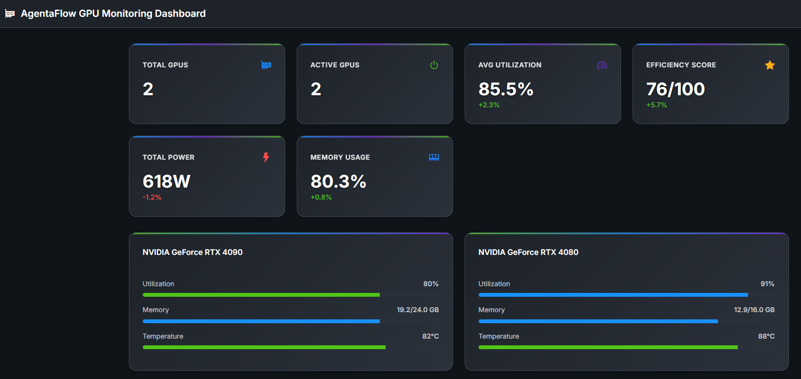
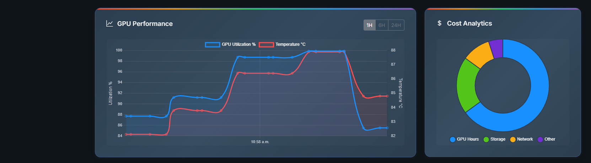
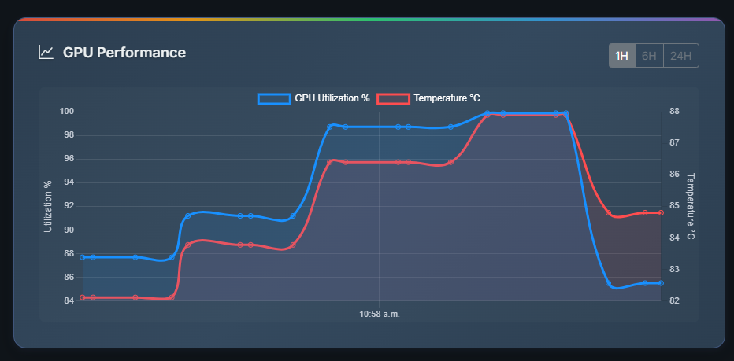
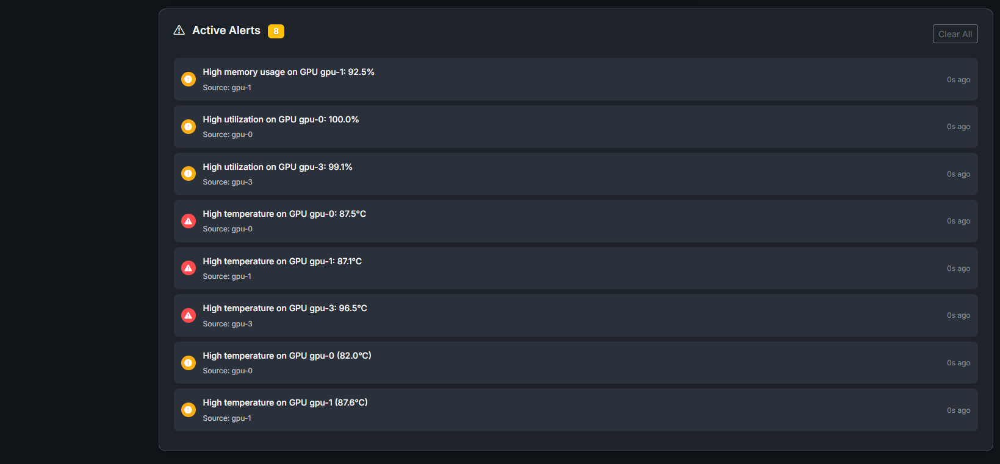
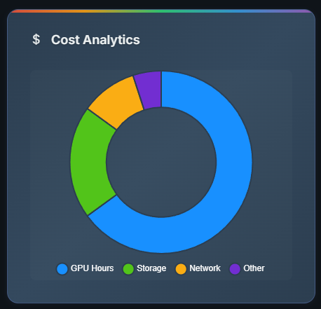

# AgentaFlow SRO Community Edition

## AI Infrastructure Tooling & Optimization Platform

**Author**: DeWitt Gibson (@dewitt4)

**Repository**: <https://github.com/Finoptimize/agentaflow-sro-community>


Deploy and manage AI infrastructure more efficiently with tools for GPU orchestration, model serving optimization, and comprehensive observability.

[](https://opensource.org/licenses/Apache-2.0)
[](https://golang.org/dl/)

## 🚀 Features

### GPU Orchestration & Scheduling

Tools that optimize GPU utilization across workloads, reducing waste:

- **Smart Scheduling**: Multiple strategies (least-utilized, best-fit, priority, round-robin)
- **Kubernetes Integration**: Native Kubernetes GPU scheduling with Custom Resource Definitions
- **Resource Optimization**: Reduce GPU idle time by up to 40%
- **Workload Management**: Efficient queuing and distribution across GPU clusters
- **Real-time Monitoring**: Track utilization, memory, temperature, and power

### AI Model Serving Optimization

Software that reduces inference costs through better batching, caching, and routing:

- **Request Batching**: Improve throughput by 3-5x with intelligent batching
- **Smart Caching**: Reduce latency by up to 50% with TTL-based caching
- **Load Balancing**: Multiple routing strategies for optimal distribution
- **Cost Reduction**: Minimize inference costs through efficient resource use

### Observability Tools for AI Systems

Enterprise-grade monitoring, debugging, and cost tracking for LLM applications and training runs:

- **Prometheus Integration**: Production-ready metrics export with 20+ GPU and cost metrics
- **Grafana Dashboards**: Pre-built visual analytics for GPU clusters and cost optimization
- **Real-time Alerting**: Automatic threshold monitoring and notification system
- **Cost Tracking**: Detailed tracking of GPU hours, tokens, and operational costs with live dashboards
- **Comprehensive Metrics**: Counters, gauges, and histograms for all operations
- **Distributed Tracing**: Full request tracing across distributed systems
- **Debug Utilities**: Multi-level logging with performance analysis

## � Screenshots

### 🌐 Web Dashboard Interface

Our production-ready web dashboard provides real-time GPU monitoring with a modern, professional interface:


*Real-time GPU monitoring dashboard with live metrics, charts, and system overview*

### 📊 Real-time Performance Charts

Interactive Chart.js visualizations show GPU performance trends and cost analytics:


*GPU utilization and temperature tracking with live cost breakdown analytics*

### 🎯 GPU Metrics Grid

Comprehensive GPU monitoring with individual card status and real-time alerts:


*Individual GPU monitoring cards showing utilization, temperature, memory usage, and health status*

### 🚨 Alert Management System

Real-time alert system with WebSocket notifications and threshold monitoring:


*Live alert feed with temperature warnings, utilization alerts, and memory notifications*

### 📈 System Analytics

Advanced analytics showing efficiency scores, cost tracking, and performance insights:


*System-wide metrics including efficiency scoring, cost per hour, and resource optimization*

> **Demo Ready**: All screenshots show the dashboard running on a local laptop without requiring NVIDIA hardware - perfect for demonstrations and development!

## �📦 Installation

```bash
go get github.com/Finoptimize/agentaflow-sro-community
```

## 🎯 Quick Start

Run the comprehensive demo:

```bash
cd cmd/agentaflow
go run main.go
```

This demonstrates all three core components working together.

## 💡 Usage Examples

### GPU Scheduling

```go
import "github.com/Finoptimize/agentaflow-sro-community/pkg/gpu"

scheduler := gpu.NewScheduler(gpu.StrategyLeastUtilized)

// Register GPU
gpu1 := &gpu.GPU{
    ID:          "gpu-0",
    Name:        "NVIDIA A100",
    MemoryTotal: 40960,
    Available:   true,
}
scheduler.RegisterGPU(gpu1)

// Submit and schedule workload
workload := &gpu.Workload{
    ID:             "training-job-1",
    MemoryRequired: 32768,
    Priority:       1,
}
scheduler.SubmitWorkload(workload)
scheduler.Schedule()
```

### Model Serving

```go
import "github.com/Finoptimize/agentaflow-sro-community/pkg/serving"

servingMgr := serving.NewServingManager(&serving.BatchConfig{
    MaxBatchSize: 32,
    MaxWaitTime:  100 * time.Millisecond,
}, 5*time.Minute)

// Process inference with automatic caching
response, _ := servingMgr.SubmitInferenceRequest(&serving.InferenceRequest{
    ModelID: "gpt-model",
    Input:   []byte("Your prompt"),
})
```

### Observability

```go
import "github.com/Finoptimize/agentaflow-sro-community/pkg/observability"

monitor := observability.NewMonitoringService(10000)

// Track costs
monitor.RecordCost(observability.CostEntry{
    Operation:  "inference",
    GPUHours:   0.5,
    TokensUsed: 1000,
    Cost:       2.50,
})

// Get cost summary
summary := monitor.GetCostSummary(startTime, endTime)
```

### Real-time GPU Metrics Collection

```go
import "github.com/Finoptimize/agentaflow-sro-community/pkg/gpu"
import "github.com/Finoptimize/agentaflow-sro-community/pkg/observability"

// Create GPU metrics collector (collects every 5 seconds)
metricsCollector := gpu.NewMetricsCollector(5 * time.Second)

// Create monitoring service integration
monitoringService := observability.NewMonitoringService(10000)
integration := observability.NewGPUMetricsIntegration(monitoringService, metricsCollector)

// Start real-time collection
metricsCollector.Start()

// Register callback for real-time monitoring
metricsCollector.RegisterCallback(func(metrics gpu.GPUMetrics) {
    fmt.Printf("GPU %s: %.1f%% util, %.1f°C, %dMB used\n",
        metrics.GPUID, metrics.UtilizationGPU, metrics.Temperature, metrics.MemoryUsed)
})

// Get system overview
overview := metricsCollector.GetSystemOverview()
fmt.Printf("Total GPUs: %v, Active: %v, Avg Util: %.1f%%\n",
    overview["total_gpus"], overview["active_gpus"], overview["avg_utilization"])

// Get efficiency metrics
efficiency := metricsCollector.GetGPUEfficiencyMetrics("gpu-0", time.Hour)
fmt.Printf("GPU efficiency: %.1f%% idle time, %.3f power efficiency\n",
    efficiency["idle_time_percent"], efficiency["avg_power_efficiency"])
```

### Prometheus/Grafana Integration

```go
import "github.com/Finoptimize/agentaflow-sro-community/pkg/observability"

// Create Prometheus exporter
prometheusConfig := observability.PrometheusConfig{
    MetricsPrefix: "agentaflow",
    EnabledMetrics: map[string]bool{
        "gpu_metrics":        true,
        "scheduling_metrics": true,
        "serving_metrics":    true,
        "cost_metrics":      true,
        "system_metrics":    true,
    },
}
exporter := observability.NewPrometheusExporter(monitoringService, prometheusConfig)

// Register GPU metrics for export
exporter.RegisterGPUMetrics()
exporter.RegisterCostMetrics()
exporter.RegisterSchedulingMetrics()

// Start metrics server for Prometheus scraping
go exporter.StartMetricsServer(8080)

// Enable GPU integration with Prometheus export
integration.SetPrometheusExporter(exporter)
integration.EnablePrometheusExport(true)

// Metrics available at http://localhost:8080/metrics
// - agentaflow_gpu_utilization_percent
// - agentaflow_gpu_temperature_celsius  
// - agentaflow_gpu_memory_used_bytes
// - agentaflow_cost_total_dollars
// - agentaflow_workloads_pending
```

### Advanced GPU Analytics

```go
// Create metrics aggregation service
aggregationService := gpu.NewMetricsAggregationService(
    metricsCollector,
    1*time.Minute,  // Aggregation interval
    24*time.Hour,   // Retention period
)
aggregationService.Start()

// Get comprehensive GPU statistics
stats, _ := aggregationService.GetGPUStats("gpu-0")
fmt.Printf("Average utilization: %.1f%%, Peak: %.1f%%\n",
    stats.AverageUtilization, stats.PeakUtilization)

// Get efficiency report
report := aggregationService.GetEfficiencyReport()
clusterEff := report["cluster_efficiency"].(map[string]interface{})
fmt.Printf("Cluster idle time: %.1f%%, Efficiency potential: %.1f%%\n",
    clusterEff["average_idle_time_percent"], clusterEff["utilization_potential"])

// Analyze performance trends
trends := aggregationService.GetPerformanceTrends("gpu-0", 4*time.Hour)
utilTrend := trends["utilization_trend"].(map[string]float64)
fmt.Printf("Utilization trend: slope=%.3f (r²=%.3f)\n",
    utilTrend["slope"], utilTrend["r_squared"])

// Get cost analysis
costAnalysis := aggregationService.GetCostAnalysis()
fmt.Printf("Estimated cost: $%.2f, Potential savings: $%.2f (%.1f%%)\n",
    costAnalysis["total_estimated_cost"], costAnalysis["total_potential_savings"],
    costAnalysis["savings_percentage"])
```

### Kubernetes GPU Scheduling

```bash
# Deploy the Kubernetes GPU scheduler
kubectl apply -f examples/k8s/scheduler-deployment.yaml

# Submit a GPU workload
./k8s-gpu-scheduler --mode=cli submit examples/k8s/pytorch-training-workload.yaml

# Monitor GPU resources across the cluster
./k8s-gpu-scheduler --mode=cli status

# Watch real-time status updates
./k8s-gpu-scheduler --mode=cli watch

# Check GPU health across all nodes
./k8s-gpu-scheduler --mode=cli health
```

```go
import "github.com/Finoptimize/agentaflow-sro-community/pkg/k8s"

// Create Kubernetes GPU scheduler
scheduler, _ := k8s.NewKubernetesGPUScheduler("agentaflow", gpu.StrategyLeastUtilized)

// Start the scheduler
ctx := context.Background()
scheduler.Start(ctx)

// Submit GPU workload
workload := &k8s.GPUWorkload{
    ObjectMeta: metav1.ObjectMeta{Name: "training-job"},
    Spec: k8s.GPUWorkloadSpec{
        Priority:          5,
        GPUMemoryRequired: 8192, // 8GB
        GPURequirements: k8s.GPURequirements{
            GPUCount: 1,
            ExclusiveAccess: true,
        },
    },
}
scheduler.SubmitGPUWorkload(workload)
```## 📊 Key Benefits

| Component | Benefit | Impact |
|-----------|---------|--------|
| GPU Scheduling | Optimized utilization | Up to 40% reduction in GPU idle time |
| Real-time Metrics | Live GPU monitoring | Real-time utilization, temperature, power tracking |
| **Prometheus Integration** | **Enterprise monitoring** | **Production-ready metrics export and alerting** |
| **Grafana Dashboards** | **Visual analytics** | **Pre-built dashboards for GPU clusters and cost tracking** |
| GPU Analytics | Performance insights | Efficiency scoring, trend analysis, cost optimization |
| Kubernetes Integration | Native K8s scheduling | Seamless integration with existing clusters |
| Request Batching | Improved throughput | 3-5x increase in requests/second |
| Response Caching | Reduced latency | Up to 50% faster responses |
| Cost Tracking | Better budgeting | Full visibility into AI infrastructure costs |

## 🏗️ Architecture

```bash
agentaflow-sro-community/
├── pkg/
│   ├── gpu/           # GPU orchestration and scheduling
│   ├── k8s/           # Kubernetes GPU scheduling integration
│   ├── serving/       # Model serving optimization
│   └── observability/ # Monitoring and debugging
├── cmd/
│   ├── agentaflow/    # Main CLI application
│   └── k8s-gpu-scheduler/  # Kubernetes GPU scheduler
└── examples/
    ├── k8s/           # Kubernetes deployment examples
    ├── monitoring/    # Grafana dashboards and configs
    └── demo/          # Demo applications
```

## � Taking Screenshots

To add actual screenshots to this README:

1. Start the demo: `go run examples/demo/web-dashboard/main.go`
2. Open browser to: `http://localhost:9000`
3. Take high-resolution screenshots and save them in `docs/screenshots/`
4. Use the filenames referenced above (dashboard-overview.png, etc.)

For detailed screenshot guidelines, see [docs/screenshots/README.md](docs/screenshots/README.md)

## �🔧 Monitoring & Observability

AgentaFlow provides **enterprise-grade monitoring** through comprehensive Prometheus/Grafana integration with production-ready dashboards and alerting.

### 🚀 Quick Start Monitoring

Run the complete Prometheus/Grafana integration demo:

```bash
cd examples/demo/prometheus-grafana
go run main.go
```

This starts:

- **Prometheus metrics server** on <http://localhost:8080/metrics>
- **Real-time GPU monitoring** with automatic export
- **Cost tracking** with live calculations
- **Performance analytics** and efficiency scoring

### 📊 Production Deployment

Deploy the full monitoring stack to Kubernetes:

```bash
# Deploy Prometheus and Grafana
kubectl apply -f examples/k8s/monitoring/prometheus.yaml
kubectl apply -f examples/k8s/monitoring/grafana.yaml

# Access Grafana dashboard (admin/agentaflow123)
kubectl port-forward svc/grafana-service 3000:3000 -n agentaflow-monitoring

# View Prometheus metrics
kubectl port-forward svc/prometheus-service 9090:9090 -n agentaflow-monitoring
```

### 🎯 Available Metrics & Dashboards

**GPU Performance Metrics:**

- `agentaflow_gpu_utilization_percent` - Real-time GPU utilization
- `agentaflow_gpu_memory_used_bytes` - Memory consumption tracking
- `agentaflow_gpu_temperature_celsius` - Thermal monitoring
- `agentaflow_gpu_power_draw_watts` - Power consumption tracking
- `agentaflow_gpu_fan_speed_percent` - Cooling system status

**Cost & Efficiency Analytics:**

- `agentaflow_cost_total_dollars` - Real-time cost tracking
- `agentaflow_gpu_efficiency_score` - Efficiency scoring (0-100)
- `agentaflow_gpu_idle_time_percent` - Resource waste tracking
- `agentaflow_cost_per_hour` - Live hourly cost calculation

**Workload & Scheduling Metrics:**

- `agentaflow_workloads_pending` - Job queue depth
- `agentaflow_workloads_completed_total` - Completion tracking
- `agentaflow_scheduler_decisions_total` - Scheduling decisions
- `agentaflow_gpu_assignments_total` - Resource assignments

**System Health & Alerts:**

- Component status monitoring
- Automatic threshold alerts
- Performance trend analysis
- Resource utilization forecasting

### 📈 Pre-built Grafana Dashboards

The integration includes production-ready dashboards:

- **GPU Cluster Overview** - Multi-node GPU monitoring
- **Cost Analysis Dashboard** - Real-time cost tracking and forecasting
- **Performance Analytics** - Efficiency scoring and optimization insights
- **Alert Management** - Threshold monitoring and notifications

For complete setup guide and advanced configuration, see [examples/demo/PROMETHEUS_GRAFANA_DEMO.md](examples/demo/PROMETHEUS_GRAFANA_DEMO.md)

## 🌐 Interactive Web Dashboard

AgentaFlow now includes a **production-ready web dashboard** for real-time GPU monitoring and system analytics.

### 🚀 Quick Start Web Dashboard

```bash
cd examples/demo/web-dashboard
go run main.go
```

**Access the dashboard**: <http://localhost:8090>

### ✨ Dashboard Features

- **📊 Real-time Monitoring**: Live GPU metrics with WebSocket updates
- **📈 Interactive Charts**: GPU utilization, temperature, and cost analytics
- **🎯 System Overview**: Total GPUs, efficiency scoring, and cost tracking
- **🚨 Alert Management**: Real-time notifications and one-click resolution
- **📱 Responsive Design**: Optimized for desktop, tablet, and mobile
- **🔌 API Integration**: REST endpoints for custom integrations

### 🎯 Use Cases

- **Data Center Operations** - Real-time cluster monitoring
- **Cost Management** - Live cost tracking and optimization
- **Performance Analysis** - Identify bottlenecks and inefficiencies  
- **Alert Management** - Proactive issue detection and resolution

For detailed dashboard documentation, see [examples/demo/web-dashboard/README.md](examples/demo/web-dashboard/README.md)

## 📖 Documentation

For detailed documentation, see [DOCUMENTATION.md](DOCUMENTATION.md)

Topics covered:

- Detailed API reference
- Scheduling strategies
- Performance optimization
- Configuration options
- Use cases and examples

## 🎓 Use Cases

1. **ML Training Clusters** - Optimize GPU allocation across multiple training jobs
2. **Kubernetes GPU Workloads** - Native Kubernetes scheduling for AI/ML workloads
3. **LLM Inference Services** - Reduce costs with intelligent batching and caching
4. **Multi-Model Deployments** - Load balance requests across model instances
5. **Cost Optimization** - Track and minimize AI infrastructure spending
6. **Performance Debugging** - Identify and resolve bottlenecks

## 🛠️ Requirements

- Go 1.21 or higher
- No external dependencies for core functionality
- Kubernetes 1.20+ (for Kubernetes GPU scheduling features)
- NVIDIA GPU drivers and nvidia-docker (for GPU monitoring)

## 📝 License

This project is licensed under the Apache License 2.0 - see the [LICENSE](LICENSE) file for details.

## 🤝 Contributing

Contributions are welcome! This is a community edition focused on providing accessible AI infrastructure optimization tools.

## 🗺️ Roadmap

- ✅ Kubernetes integration for GPU scheduling
- ✅ Real-time GPU metrics collection
- ✅ **Prometheus/Grafana integration** - Complete monitoring stack with dashboards
- ✅ **Production-ready observability** - Enterprise-grade metrics export and visualization
- ✅ **Web dashboard for monitoring** - Interactive real-time web interface with charts and alerts
- ✅ **OpenTelemetry distributed tracing** - Complete tracing integration with Jaeger/OTLP support

## 🚀 Enterprise Edition (Coming Soon)

Looking for advanced features for production environments? Our **Enterprise Edition** will include:

- **Multi-cluster Orchestration**: Manage GPU resources across multiple Kubernetes clusters
- **Multi-cloud GPU resource support**: Support for running in Azure, Google Cloud, Vercel, DigitalOcean, or other clouds
- **Hosted MCP Server**: Intergrate AgentaFlow SRO directly into your AI models
- **Self-optimizing AI Agents**: Learns your workflows for personalized optimization
- **Advanced Scheduling Algorithms**: Cost optimization algorithms and priority queues for enterprise workloads  
- **RBAC and Audit Logs**: Role-based access control and comprehensive audit logging
- **Enterprise Integrations**: Slack alerts, DataDog monitoring, and other enterprise tools
- **SLA Support**: Guaranteed service levels with dedicated support
- **Usage-based Billing Features**: Advanced cost tracking and billing automation
- **Data Center Edition**: Run on bare metal in the data center

*Contact us for early access and enterprise pricing.*

## 📞 Support

For questions, issues, or contributions, please open an issue on GitHub.

---

Built with ❤️ by FinOptimize for AgentaFlow
